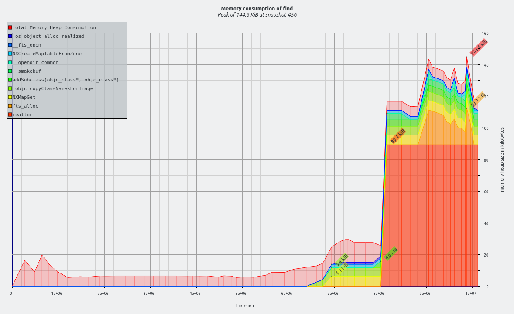
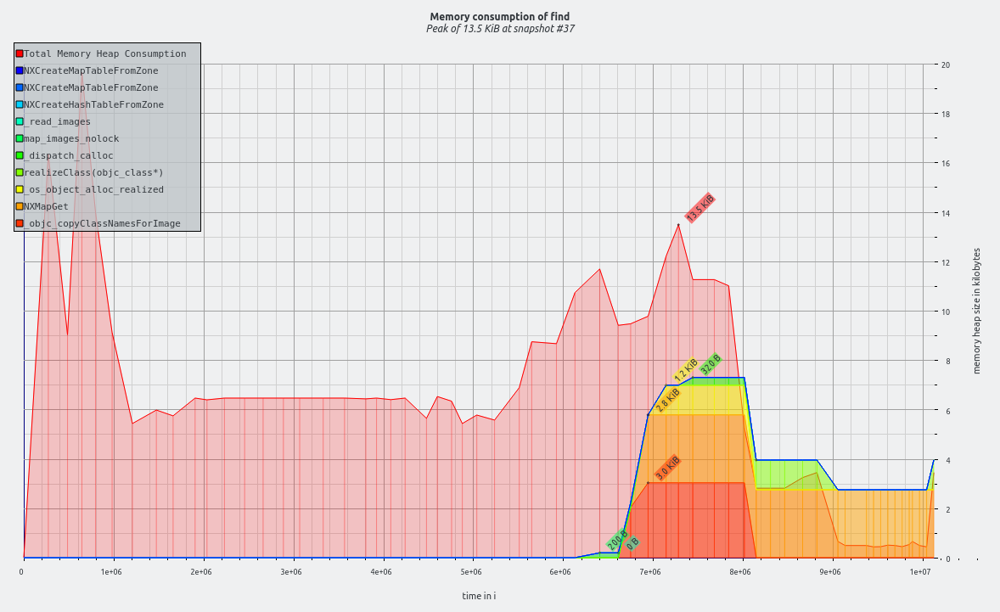

# massif-cherrypick

🍒 A massif (valgrind) extension to analyze memory consumptions for only specific functions.

massif-cherrypick takes an massif.out file, and  
**forges** a new one containing only stats from functions that match the specified pattern.

The new massif.out file can then be used with `ms_print`, `massif-visualizer` or any other similar post-analysis tools.

## Dependencies

- g++
- ... and nothing else


## Building

```bash
make
```


## Usage

```bash
./massif-cherrypick {massif.out file} {pattern} [--merge-stacks] [--clear-heap-extra]
```

`{pattern}` supports Regular Expression (ECMAScript regular expressions pattern syntax).


## Sample Usage

> Find out the memory consumption of `libdispatch` during `find`

### Profile the program with the `massif` tool from Valgrind
```bash
# generates massif.out.15324
valgrind --tool=massif --stacks=yes --detailed-freq=1 find .
```

### Launch `massif-cherrypick` to forge a new massif.out file
```bash
# generates massif.out.15324.cherry
./massif-cherrypick massif.out.15324 libdispatch
```

### (Original) massif.out.15324 on `massif-visualizer`



### (New) massif.out.15324.cherry on `massif-visualizer`



